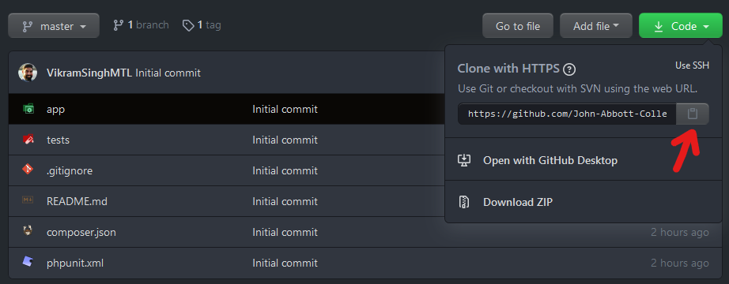
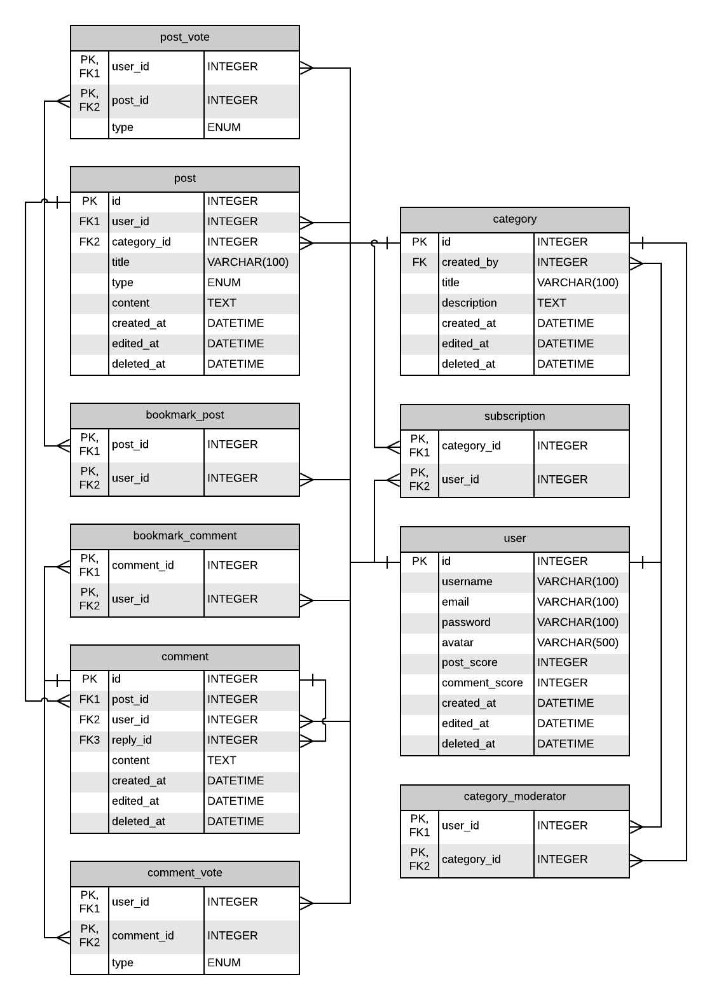

# Assignment 1 - Models 💾

- 💯**Worth**: 7.5%
- 📅**Due**: September 20, 2020 @ 23:59
- 🙅🏽‍**Penalty**: Late submissions lose 10% per day to a maximum of 3 days. Nothing is accepted after 3 days and a grade of 0% will be given.

## 📥 Submission

Since we'll be using [Git](https://git-scm.com/) and [GitHub Classroom](https://classroom.github.com/) for this assignment, all you need to do to submit is to commit and push your code to the repository. Over the course of working on the assignment, you should be committing and pushing as you go. I will simply take the last commit that was made before the assignment deadline and grade that one.

## 🔨 Setup

1. Download [Environment Configuration [PHP + MySQL]](https://jac-moodle.dawsoncollege.qc.ca/mod/resource/view.php?id=40320) and replace the contents of your `Development-Environment` folder with the files from the downloaded zip. Take care not to delete your `public_html` folder in the process!
   - The new Docker files from this downloaded zip contain the configuration information needed to spin up a **MySQL** container as well as a **PHP** container.
   - The `mysql` folder will be mounted into the MySQL container at `/scripts`. This is only relevant to those who want to use command line MySQL and not GUI.
2. Using a VSCode window that's **not** in a container, stop all containers from the Docker VSCode tab and run `docker-compose up --build` from a terminal inside `Development-Environment`.
3. Attach a VSCode to the new PHP container. Make sure that inside the container, you're currently in `/var/www/html`.
4. `mkdir Assignments && cd Assignments`
5. Click `Code -> 📋` to copy the URL to the repository.

   

6. Clone the Git repo `git clone <paste URL from GitHub>` (without the angle brackets).
   - You may have to use the `HTTPS` or `SSH` URL to clone depending on your settings. If one doesn't work, try the other by clicking `Use SSH` or `Use HTTPS` above the 📋, and copy the new URL.
7. You should now have a folder inside `Assignments` called `web-programming-f20-assignment-1-githubusername`.

### 🐬 MySQL Connection

In DBII we used a GUI to connect to our MySQL container called [MySQL Workbench](https://dev.mysql.com/downloads/workbench/). You still have this option if you wish to do so. The connection information (host, port, username, password, etc.) will be the same as last semester so you should be able to connect without any issues.

For those who are aspiring command line warriors ⚔️, try the following:

1. Attach a VSCode window to the MySQL container.
2. From the terminal, run `mysql -u root -p < /scripts/SetupA1DB.sql` to execute the setup script inside of the database engine.
3. Enter the password `rootpassword`. If you get no indication that anything happened, that probably means it was successful.
4. Enter MySQL by running `mysql -u root -p` and entering the same password. Your prompt should now read `mysql>`.
5. Run `show databases;` (semicolon!) to display the list of databases. `Assignment-1` should be one of them if the initial setup script ran successfully.
6. Run `use Assignment-1;` to select that database.
7. Run `show tables;` to display the list of tables.
8. You can now run any DDL/DML statements you want from here. Try inserting a `user` and then selecting it.

## 🎯 Objectives

- **Write** models to represent real-world entities of the application.
- **Transact** data to and from a database using models.

## 🖋️ Description

Over the next several assignments, you will be building a **Reddit** clone web app. The web app will follow the *MVC architectural pattern*. In this assignment, you will be writing the **models** required to handle the data. The models' classes and methods will have to comply with specific requirements so that they may successfully pass the test suite. The test suite will be available for you to use as much as you want while developing the models.

Never been on Reddit? [Watch this video](https://www.youtube.com/watch?v=tlI022aUWQQ)!

Just as in the previous exercise, you'll be writing the models and testing them against the provided test suite. The main difference now is that you'll be talking to a real database instead of the mock database class. This means that inside of the model methods, you'll have to:

1. **Connect** to the MySQL database
2. **Write** the SQL statement
3. **Prepare** the statement
4. **Bind** any parameters
5. **Execute**
6. **Bind/Fetch** any results that are returned

Do not modify any of the existing methods inside of the model classes. You are, however, free to write any additional functions or classes you think may help. For example, you will have to add the necessary getters/setters.

A `Database` class has been provided for you that will take care of connecting to the database. Most likey, you won't have to change anything in this class. Simply create a new instance and use the `connect()` method when you need a connection.

You'll already know what your grade is before submitting since the grade for this assignment will come purely from your test results. If you pass all the tests, you get 💯!

## 📈 ERD

> 💡 For this assignment, we'll only be implementing the four main entities: `User`, `Category`, `Post`, and `Comment`.

### 👤 User

A user account is required to be able to do anything (except browse) on the site. As a user, you can:

- Create categories
- Moderate categories
- Subscribe to categories
- Create posts (URL or text)
- Comment on posts
- Comment on other comments (i.e. replies)
- Vote on posts and/or comments (⬆ upvote or ⬇ downvote)
- Bookmark posts and/or comments

### 📁 Category

A category (aka subreddit) is a collection of posts. The content of the posts in a certain category should pertain to the category's topic.

For example, the Star Wars category should contain posts about Star Wars. The Star Trek category should contain posts about Star Trek. If someone tried to post a Star Trek article in a Star Wars category, that post would probably get many downvotes from other users.

If a post is too inappropriate for a category, then the moderators of that category have the power of deleting that post.

### 📝 Post

A post can either be text (ex. your opinion on the last Star Wars movie) or a URL to another site (ex. a link to a Star Wars trailer on YouTube). Both text and URL posts have a title. Only the content of a text post can be edited by the user who posted it.

Users can upvote or downvote the post based on whether they think it's a good post or not. The order of the posts shown to the user will usually be sorted by the net votes (upvotes minus downvotes) which leads to a feed where the content is curated by the community.

If a user really likes a post and wants to save it for future reference, they may bookmark the post.

### 📣 Comment

A comment can be left on a post (ex. "Your opinion about \<*the latest Star Wars movie*\> is wrong and here's why!") or on another comment (ex. "Your opinion about \<*why the original opinion about the latest Star Wars movie is wrong*\> is wrong, and here's why!").

Just like posts, user can upvote or downvote comments they think are conducive to the conversation. Just like with posts, the most upvoted comments float to the top.

If a user really likes a comment and wants to save it for future reference, they may bookmark the comment.
